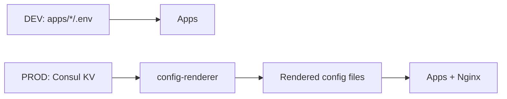
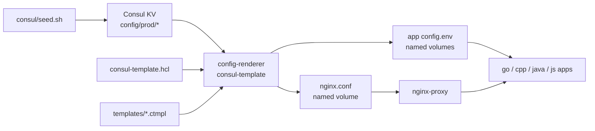
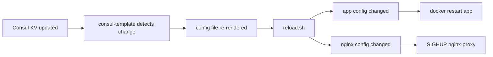
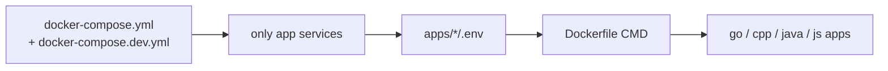

# consul-prototype


Prototype centralized configuration management using **Consul KV** and **consul-template** for multi-environment Docker services.

The main idea is simple:



In the current architecture, `consul-template` only runs in one central container: **`config-renderer`**. Application and Nginx images do not run `consul-template` themselves.

---

## Project Structure

```
consul-prototype/
├── docker-compose.yml                 # PROD topology
├── docker-compose.dev.yml             # DEV override
├── README.md
│
├── apps/
│   ├── go-app/
│   │   ├── Dockerfile                 # default CMD: /app/server
│   │   ├── main.go
│   │   ├── go.mod
│   │   └── .env                       # local DEV config
│   ├── cpp-app/
│   │   ├── Dockerfile                 # default CMD: /app/server
│   │   ├── main.cpp
│   │   └── .env
│   ├── java-app/
│   │   ├── Dockerfile                 # default CMD: java -cp /app Main
│   │   ├── Main.java
│   │   └── .env
│   └── js-app/
│       ├── Dockerfile                 # default CMD: node /app/main.js
│       ├── main.js
│       └── .env
│
├── consul/
│   └── seed.sh                        # bootstrap initial Consul KV values
│
├── consul-template/
│   ├── Dockerfile                     # config-renderer image
│   ├── consul-template.hcl            # render mapping + reload commands
│   ├── reload.sh                      # restart app / reload Nginx handler
│   └── templates/
│       ├── go-app.env.ctmpl
│       ├── cpp-app.env.ctmpl
│       ├── java-app.env.ctmpl
│       ├── js-app.env.ctmpl
│       └── nginx.conf.ctmpl
│
├── nginx/
│   ├── Dockerfile
│   └── start.sh                       # wait for generated config, then start Nginx
│
└── runtime/
    └── start-app.sh                   # source rendered config, then exec app command
```

---

## Architecture Overview

### PROD Flow



### Change Flow



### DEV Flow



---

## Environment Model

| Environment | Active Services | Config Source | Runtime Behavior |
|-------------|-----------------|---------------|------------------|
| DEV | `go-app`, `cpp-app`, `java-app`, `js-app` | `apps/*/.env` | Apps run directly from Dockerfile `CMD` |
| PROD | Consul, seed, config-renderer, apps, Nginx | `config/prod/*` in Consul KV | `config-renderer` renders config into volumes |

---

## Component Responsibilities

| Component | Responsibility |
|-----------|----------------|
| `consul-server` | Consul KV store and UI/API endpoint |
| `consul-seed` | One-shot container that bootstraps `config/prod/*` keys |
| `config-renderer` | Central `consul-template` process that renders all config files |
| `go-app`, `cpp-app`, `java-app`, `js-app` | Demo services that read runtime config as environment variables |
| `nginx-proxy` | Reverse proxy using rendered `/generated/nginx.conf` |
| Docker named volumes | Bridge rendered files from `config-renderer` to app/Nginx containers |

---

## Consul KV Layout

```
config/prod/
├── shared/
│   ├── TZ
│   ├── LOG_FORMAT
│   └── CONFIG_VERSION
├── go-app/
│   ├── APP_NAME
│   ├── APP_PORT
│   └── LOG_LEVEL
├── cpp-app/
│   ├── APP_NAME
│   ├── APP_PORT
│   └── LOG_LEVEL
├── java-app/
│   ├── APP_NAME
│   ├── APP_PORT
│   └── LOG_LEVEL
├── js-app/
│   ├── APP_NAME
│   ├── APP_PORT
│   └── LOG_LEVEL
└── nginx/
    ├── domain
    └── routes/
        ├── go-app
        ├── cpp-app
        ├── java-app
        └── js-app
```

---

## Ports

| Service | Host | Container | Description |
|---------|-----:|----------:|-------------|
| Consul | 8500 | 8500 | Consul UI/API |
| Nginx | 8088 | 8080 | Reverse proxy |
| Go App | 8001 | 8001 | Direct access |
| C++ App | 8002 | 8002 | Direct access |
| Java App | 8003 | 8003 | Direct access |
| JS App | 8004 | 8004 | Direct access |

---

## Quick Start

### PROD Mode

```bash
docker compose down -v
docker compose up --build -d
docker compose ps -a
```

Verify rendered config:

```bash
docker exec go-app cat /config/config.env
docker exec nginx-proxy cat /generated/nginx.conf
```

Verify endpoints:

```bash
curl localhost:8088/go-app/
curl localhost:8088/cpp-app/
curl localhost:8088/java-app/
curl localhost:8088/js-app/
```

### DEV Mode

```bash
docker compose -f docker-compose.yml -f docker-compose.dev.yml up --build -d
docker compose -f docker-compose.yml -f docker-compose.dev.yml ps
```

Expected DEV services:

```
go-app
cpp-app
java-app
js-app
```

Consul, config-renderer, and Nginx are disabled in DEV mode.

---

## Demo Commands

### Inspect Consul KV

```bash
docker exec consul-server consul kv get -recurse config/prod/
```

### App Config Change

```bash
docker inspect -f '{{.State.StartedAt}}' go-app
docker exec consul-server consul kv put config/prod/go-app/LOG_LEVEL error
sleep 8
docker exec go-app cat /config/config.env
docker inspect -f '{{.State.StartedAt}}' go-app
docker logs config-renderer --tail 20
```

Expected:

```
LOG_LEVEL=error
StartedAt changes
Restarting go-app after config render...
```

### Shared Config Change

```bash
docker inspect -f '{{.Name}} {{.State.StartedAt}}' go-app cpp-app java-app js-app
docker exec consul-server consul kv put config/prod/shared/CONFIG_VERSION v2
sleep 8
docker exec go-app cat /config/config.env
docker exec cpp-app cat /config/config.env
docker exec java-app cat /config/config.env
docker exec js-app cat /config/config.env
docker logs config-renderer --tail 30
```

Expected:

```
CONFIG_VERSION=v2
go-app, cpp-app, java-app, and js-app restart
Nginx does not reload because its template does not read shared app config
```

### Nginx Config Change

```bash
docker exec consul-server consul kv put config/prod/nginx/domain demo.local
sleep 8
docker exec nginx-proxy cat /generated/nginx.conf
docker logs config-renderer --tail 20
```

Expected:

```
server_name demo.local
Reloading nginx-proxy after nginx config render...
```

---

## Standalone App Image Test

Each app image has a default `CMD`, so the image can run outside Docker Compose if environment variables are provided.

```bash
docker run --rm --name go-app-standalone \
  -e APP_NAME=go-app-local \
  -e APP_PORT=8001 \
  -e LOG_LEVEL=debug \
  -p 9001:8001 \
  consul_prototype-go-app
```

From another terminal:

```bash
curl localhost:9001
docker stop go-app-standalone
```

---

## Design Notes

| Decision | Reason |
|----------|--------|
| Central `config-renderer` | Keeps `consul-template` out of app and Nginx images |
| App Dockerfile `CMD` | App images can run independently |
| PROD `entrypoint` + `command` | `entrypoint` loads rendered config; `command` defines the real app process |
| Named volumes | Rendered files are shared without baking config into images |
| `docker restart` for apps | Apps read config during startup, so running processes must restart |
| `SIGHUP` for Nginx | Nginx supports config reload without full container restart |

---

## Prototype Limitations

| Limitation | Note |
|------------|------|
| `runtime/start-app.sh` still exists | Adapter because apps read environment variables, not config files directly |
| `nginx/start.sh` still exists | Adapter to wait for generated config before starting Nginx |
| Restart/reload uses Docker CLI | Acceptable for Docker Compose prototype; production should use scheduler/init system |
| No secret management | This prototype uses plain KV values, not Vault/ACL/encryption |
| Apps are not config-file native | If apps read `/config/config.env` directly, the startup adapter can be removed |

---

## Troubleshooting

| Symptom | Check |
|---------|-------|
| Port already allocated | Run `docker ps` and stop any standalone test container using the same port |
| Nginx upstream not found | Ensure app containers are `Up`, then restart Nginx |
| Config did not update | Check `docker logs config-renderer --tail 50` |
| DEV still shows Consul/Nginx | Validate with `docker compose -f docker-compose.yml -f docker-compose.dev.yml config` |

---

## Final Status

This prototype has moved from distributed per-container config rendering to centralized config rendering:

```
Before: each app/Nginx ran its own consul-template
After : only config-renderer runs consul-template
```

The result is a cleaner Docker image model, centralized rendering logic, and a clearer separation between DEV and PROD configuration sources.
